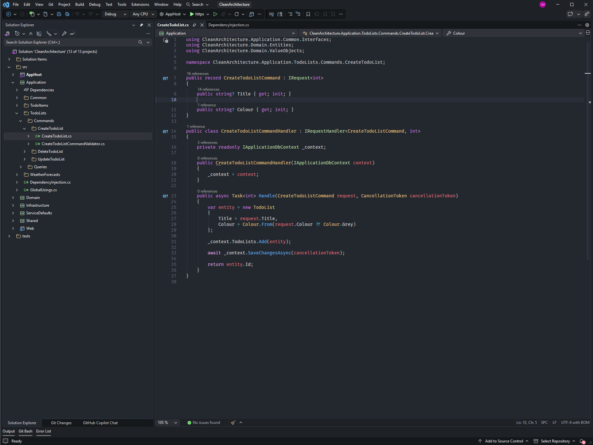
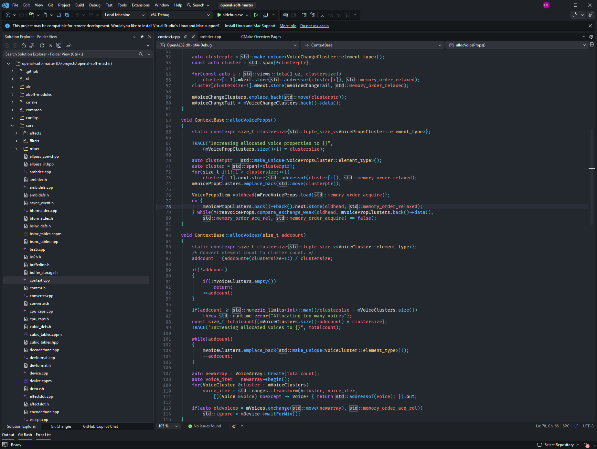

## One Dark Pro Darker 2026 - Dark theme for Visual Studio 2026

**One Dark Pro Darker 2026** brings the [VS Code One Dark Pro Darker palette](https://github.com/Binaryify/OneDark-Pro/blob/master/themes/OneDark-Pro-darker.json) to **Visual Studio 2026**. It uses `#23272e` for the editor and active tabs, `#1e2227` for surrounding chrome, and the existing One Dark Pro syntax colors.

This version preserves the original aesthetic, but includes:

* fixes for outdated or deprecated theme keys
* adjustments for the new VS2026 color engine
* darker editor, tab, tool window, title bar, and status bar surfaces
* improved visibility across tool windows and editor areas
* near-white class fields and properties, while local variable colors stay unchanged
* compatibility fixes for the updated Visual Studio UI
* **a full VSIX build script for easy editing and rebuilding**

---

## Repository Contents

```
build_vsix.py        – Python script that builds a .vsix theme from the YAML config
OneDarkProDarker2026.yaml  – Darker theme configuration with updated color sections
OneDarkProDarker2026.png   – Theme icon image for extension tab/marketplace page
```

The repository **includes a standalone VS theme build script**, allowing you to:

* edit colors directly in YAML
* rebuild a complete VSIX with one command
* tweak, fork, or customize the theme quickly


---

## Building the VSIX

Requires **Python 3.8+** and the **PyYAML** library.

### 1. Install dependency:

```sh
pip install pyyaml
```

### 2. Build the theme:

```sh
python build_vsix.py -i OneDarkProDarker2026.yaml -o OneDarkProDarker2026
```

The script produces VS extension (theme):

```
OneDarkProDarker2026.vsix
```

---

## Base Theme Screenshots

These screenshots show the original Visual Studio 2026 adaptation before the Darker palette changes.




---

## Customizing the Theme

Edit everything inside:

```
OneDarkPro2026.yaml
```

Then rebuild:

```sh
python build_vsix.py -i OneDarkPro2026.yaml -o OneDarkProDarker2026
```

You can modify:

* individual colors
* entire sections
* GUIDs
* metadata (name, author, version)
* tags and description

The Python builder handles the packaging.

---

## Credits

* This repository is forked from [OneDarkPro2026](https://github.com/bayaraa/OneDarkPro2026) by [Bayaraa](https://github.com/bayaraa).
* The Visual Studio 2026 theme configuration is based on the **One Dark Pro** theme by Adrian Wilczyński:
  [https://marketplace.visualstudio.com/items?itemName=adrianwilczynski.one-dark-pro](https://marketplace.visualstudio.com/items?itemName=adrianwilczynski.one-dark-pro)
* The darker palette follows [Binaryify's One Dark Pro Darker theme for VS Code](https://github.com/Binaryify/OneDark-Pro/blob/master/themes/OneDark-Pro-darker.json).
